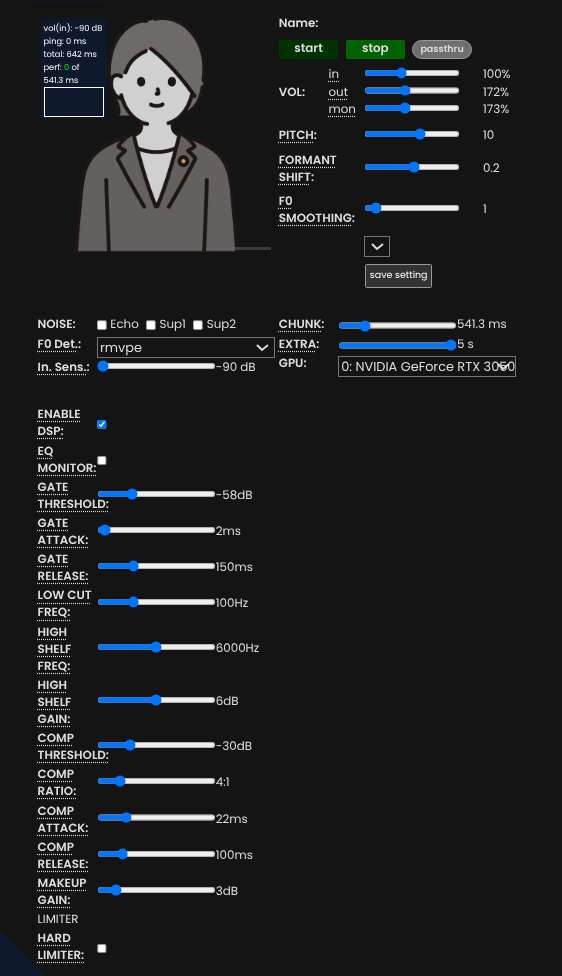

# RVC-Pro-Studio
> **python 3.10+ | tested on linux fedora (gnome)**

  

this fork adds built-in dsp so you don't need a separate daw (like fl studio or reaper) or virtual audio cables to clean your mic audio before rvc inference.

feel free to fork this if you need other effects/plugins.

**note:** this built-in dsp is designed for fast, real-time inference. for offline voice dubbing, a professional daw (like fl studio) will still offer higher quality processing.

### my custom contributions
*   **dsp pre-processing:** added a noise gate, eq, and compressor that process raw microphone input before the ai vocoder.
*   **f0 smoothing (median filter):** added a pitch smoother to prevent sudden pitch spikes and octave errors.
*   **hard limiter:** added a limiter to prevent the audio from clipping and crashing the model on loud input.
*   **ui & storage integration:** wired new dsp and smoothing sliders into the react frontend, with persistent json saving per-model.

---

## 🚀 quick start & installation
the installation process remains largely the same as the original architecture.

1. clone this repository to your machine.
2. ensure you have python 3.10+ installed.
3. install the required dependencies (e.g., `pip install -r requirements.txt`).
4. export/extract your downloaded voice models into the `server/model_dir` directory.
5. start the server (e.g., by running `python main.py` inside the server directory).
6. open the localhost link in your browser to access the ui.

---

## the dsp tuning guide (pre-processing)
these settings affect your physical microphone and room acoustics.

*   **enable dsp:** toggle the dsp chain on or off.
*   **gate threshold:** set to `-50 db` to mute background noise when quiet.
*   **gate attack & release:** keep release around `150 ms` so trailing ends of words aren't cut off.
*   **low cut freq:** removes bass rumble. set to `100 hz` to reduce heavy desk thuds.
*   **high shelf freq & gain:** boosts clarity for consonants (s, t, p). set freq to `6000 hz` and boost gain by `+4 db` to `+6 db` to fix a muffled mic.
*   **comp threshold & ratio:** reduces volume when you speak loudly. a ratio of `4:1` at `-30 db` evens out your voice.
*   **comp attack:** how fast the compressor reacts. keep this around `22 ms` so sharp consonants (like "t") pass through before compression starts.
*   **comp release:** how fast the compressor lets go. `100 ms` is a standard baseline.
*   **makeup gain:** restores overall volume lost to compression.
*   **hard limiter:** prevents clipping if you yell. leave off unless needed, as it causes distortion when triggered.

---

## the ai tuning guide (rvc parameters)
these settings affect how the vocoder interprets your voice.

*   **tune (pitch):** aligns your pitch with the target model. if low notes cause the model to glitch (vocal fry), raise this value.
*   **index ratio:** controls the accent. `0` relies on your exact inflection. `1` relies heavily on the training data's inflection.
*   **protect:** ignores wind and breath sounds (s, f, h, t). 
    *   *raise it (e.g., 0.45):* if consonants turn into a metallic buzz or breath turns into a hum.
    *   *lower it (e.g., 0.33):* if your voice sounds muffled or like you have a lisp.
*   **formant shift:** changes throat size. `+0.05` sounds slightly younger/brighter. negative values sound deeper/larger.
*   **f0 smoothing:** smooths sudden pitch jumps.
    *   *raise it (e.g., 3 to 7):* if laughing or yelling causes voice cracks or octave errors.
    *   *lower it (e.g., 0):* if your normal speaking voice sounds flat or robotic.

---

## the "quiet speaker" dsp preset
if you have a quiet voice and want a punchy voice without background noise bleeding through, use this setup:

*   **gate threshold:** -45 db to -50 db
*   **low cut freq:** 100 hz
*   **high shelf freq:** 6000 hz
*   **high shelf gain:** +6.0 db
*   **comp threshold:** -30 db
*   **comp ratio:** 4:1
*   **comp attack:** 22 ms
*   **comp release:** 100 ms
*   **makeup gain:** +1.0 db to +3.0 db
*   **hard limiter:** off

---

**credits:** thanks to [deiteris](https://github.com/deiteris) and [w-okada](https://github.com/w-okada) for the original client/server architecture.
